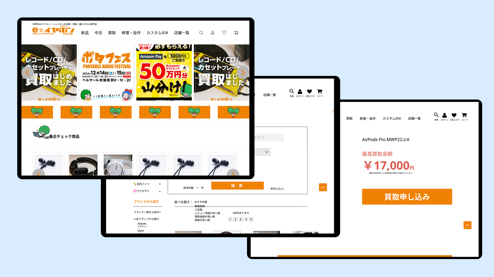
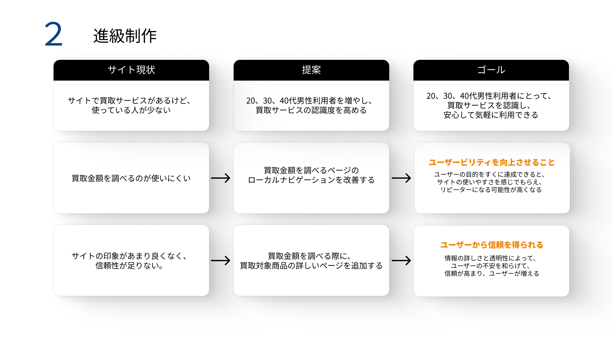
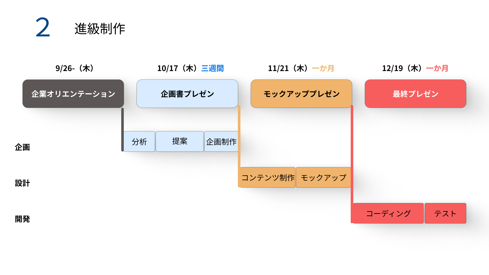

# React + Vite

## PC版

## モバイル版

# 進級制作紹介
・課題：e☆イヤホンサイトのリニューアル

・制作時間：2024年10月ー2024年12月

・使用ツール：Figma　React　Adobe Photoshop

・要望：１、買取コンテンツを強化して欲しい。２、全体的なサイトリニューアルをしてほしい。

# 企画階段

# 時間割

# 工夫したところ
・ECサイトが頻繁な更新に対応できるよう、Reactで各要素をコンポーネント化し、メンテナンスの効率化を図りました。

・React-routerを導入することで、ECサイトの複数ページ間をスムーズに遷移できるようになりました。

・JSONを導入する。

This template provides a minimal setup to get React working in Vite with HMR and some ESLint rules.

Currently, two official plugins are available:

- [@vitejs/plugin-react](https://github.com/vitejs/vite-plugin-react/blob/main/packages/plugin-react/README.md) uses [Babel](https://babeljs.io/) for Fast Refresh
- [@vitejs/plugin-react-swc](https://github.com/vitejs/vite-plugin-react-swc) uses [SWC](https://swc.rs/) for Fast Refresh
